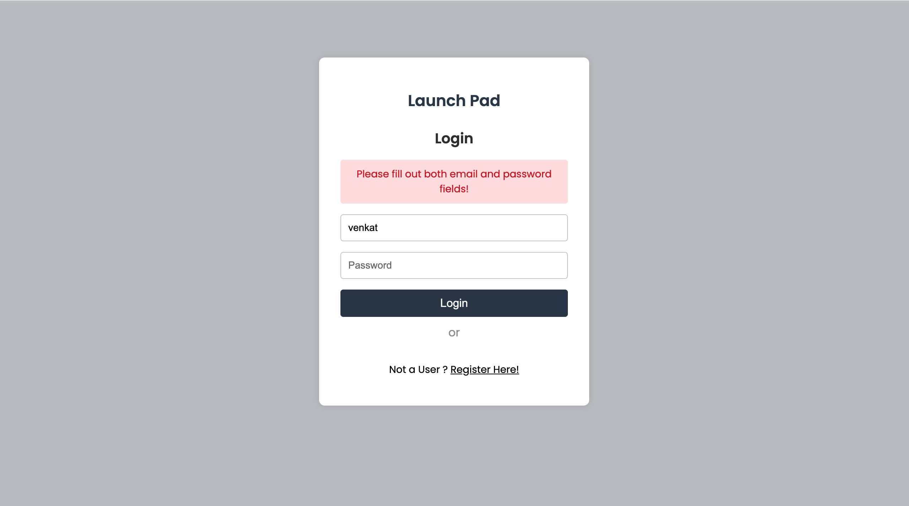
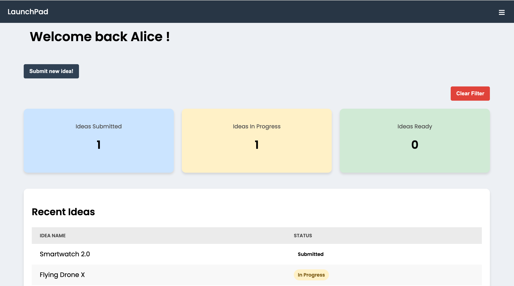
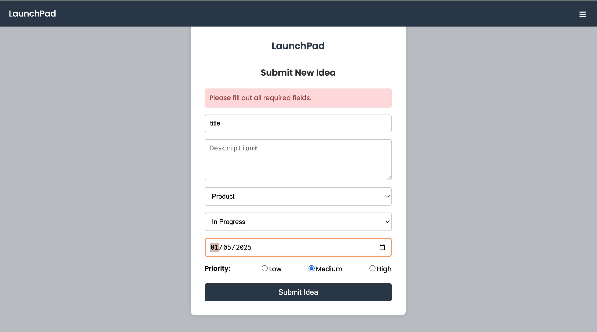
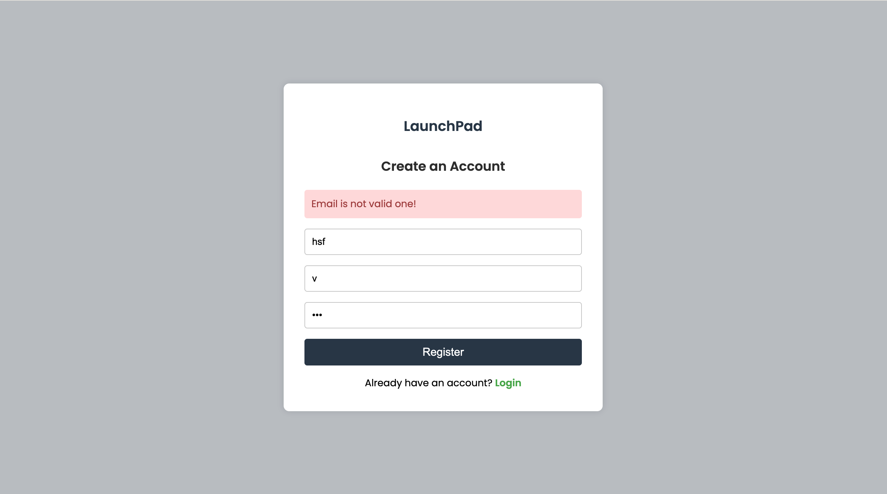

🚀 Smart Product Launch Dashboard

A full-stack, real-world dashboard app to manage product ideas, track their statuses, and monitor launch readiness — built with React, Dockerized, Automated via GitHub Actions, and Deployed on AWS EC2.

🔗 Live Project

🚀 View Live App Here

(http://43.204.107.137/) 

Deployed on AWS EC2, Dockerized, and auto-deployed using GitHub Actions.

🛠️ Tech Stack

Frontend: React.js (with Context API)

State Management: React Context API + useState

Routing: React Router DOM

Forms: Controlled Components

Global State: Custom Context Provider

Deployment: Docker, Nginx

Automation: GitHub Actions (CI/CD)

Hosting: AWS EC2 (Ubuntu Server)

📋 Features

🔐 Protected Routes for authenticated users

🔎 Filter Ideas by Status (Submitted / In Progress / Launch Ready)

➡️ Submit new ideas (Form Handling)

👤 Register and Login with dummy users

🎨 Beautiful responsive UI

📦 Dockerized build (Multi-stage)

☁️ Automated AWS EC2 Deployment via GitHub Actions

## 📸 Project Preview

### 🖼️ Login Page

### 🖼️ Dashboard Page

### 🖼️ Submit Idea Page

### 🖼️ Register Page

📂 Folder Structure

├── public/
├── src/
│   ├── components/
│   ├── context/        # AppContext (Global State)
│   ├── route-guard/    # Protected Route Component
│   ├── pages/          # Dashboard, Login, Register, Submit Idea
│   ├── styles/         # CSS Files
│   ├── data/           # Dummy users and ideas
│   └── App.jsx
├── .dockerignore       # Files/folders excluded from Docker build
├── Dockerfile
├── nginx.conf
├── .github/workflows/  # GitHub Actions Deployment Workflow
├── package.json
├── README.md

🧑‍💻 Getting Started

🧪 Prerequisites

Node.js & npm

Docker

🧠 How to Run Locally

# Clone the repo
git clone https://github.com/LevNgx/smart-product-launch-dashboard.git
cd smart-product-launch-dashboard

# Install dependencies
npm install

# Start dev server
npm run dev

App runs at: http://localhost:5173

🐳 Docker Setup (Production)

# Build Docker Image
docker build --platform linux/amd64 -t smart-launchpad .

# Run Docker Container
docker run -d -p 80:80 smart-launchpad

Built React App → Served via Nginx inside Docker

Optimized for AWS EC2 Linux servers

⚙️ AWS Deployment (Summary)

EC2 Ubuntu Instance setup

Docker + Docker Compose installed

SSH configured using public/private key authentication

GitHub Actions triggers auto-deployment on every push to main branch

📚 Key Concepts Covered

React Fundamentals (JSX, Components, Props, State, Events)

Context API for Global State

Protected Routes & Authentication

Controlled Forms + Validation

Docker Multi-stage Build

Nginx Server Configuration

GitHub Actions CI/CD Pipelines

AWS EC2 Hosting

💡 Future Enhancements

Google Authentication (OAuth)

Real database connection (PostgreSQL)

User-specific ideas filtering

Search and Pagination for Ideas

✨ Author

Name: Sai Venkat Nijagala

LinkedIn: linkedin.com/in/sai-venkat-nijagala-241427281

Email: venkat.nijagala@gmail.com

🚀 Let's Launch Ideas Smarter!

